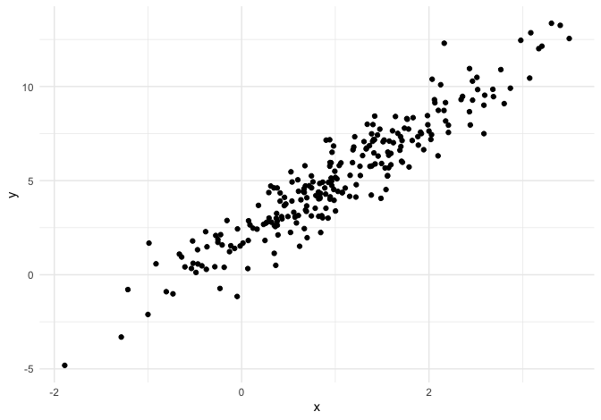
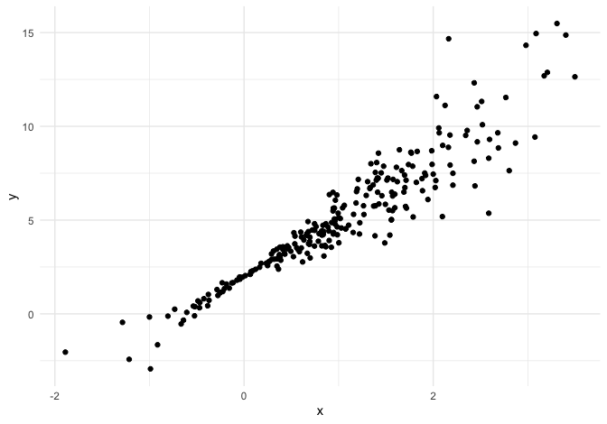
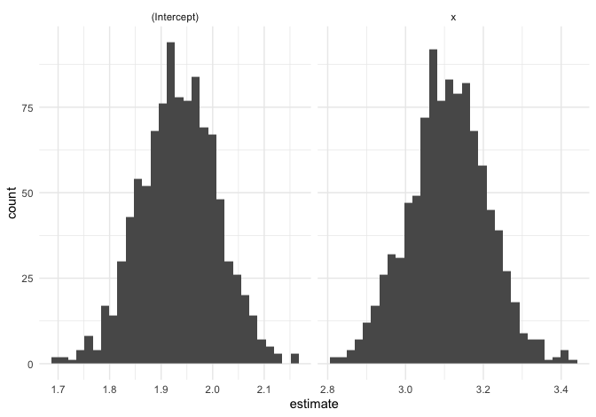
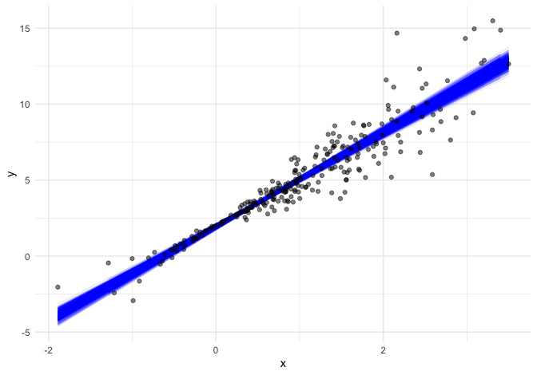
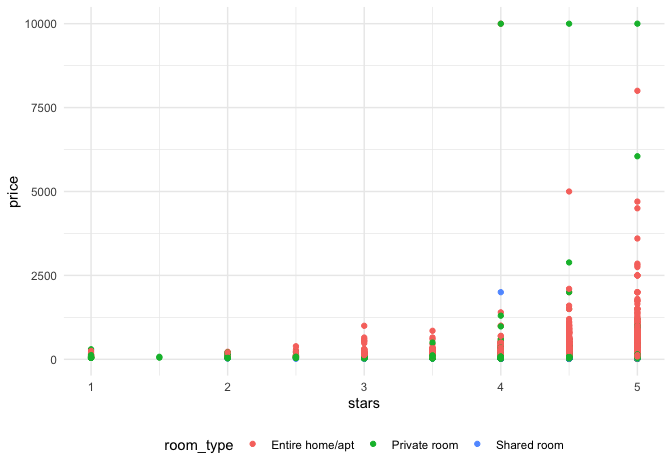
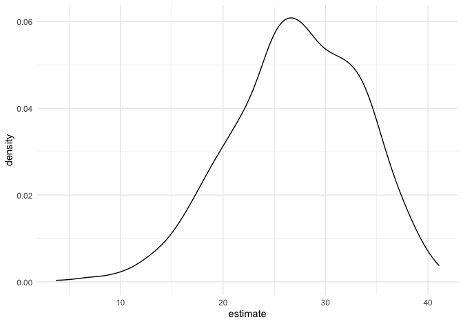

bootstrapping
================
Kaila Boyer
11/28/2021

## Simulate a dataset

``` r
set.seed(1)
n_samp = 250

sim_df_const = tibble(
  x = rnorm(n_samp, 1, 1), 
  error = rnorm(n_samp, 0, 1), 
  y = 2 + 3 * x + error
)


sim_df_nonconst = sim_df_const %>% 
  mutate(error = error * 0.75 * x, 
         y = 2 + 3 *x + error)
```

make a plot

``` r
sim_df_const %>% ggplot(aes(x = x, y = y)) + 
  geom_point()
```



``` r
sim_df_nonconst %>% ggplot(aes(x = x, y = y)) + 
  geom_point()
```



``` r
sim_df_const %>% 
  lm(y ~ x, data = .) %>% 
  broom::tidy()
```

    ## # A tibble: 2 × 5
    ##   term        estimate std.error statistic   p.value
    ##   <chr>          <dbl>     <dbl>     <dbl>     <dbl>
    ## 1 (Intercept)     1.98    0.0981      20.2 3.65e- 54
    ## 2 x               3.04    0.0699      43.5 3.84e-118

``` r
sim_df_nonconst %>% 
  lm(y ~ x, data = .) %>% 
  broom::tidy()
```

    ## # A tibble: 2 × 5
    ##   term        estimate std.error statistic   p.value
    ##   <chr>          <dbl>     <dbl>     <dbl>     <dbl>
    ## 1 (Intercept)     1.93    0.105       18.5 1.88e- 48
    ## 2 x               3.11    0.0747      41.7 5.76e-114

implement a procedure to get better standard errors in cononst df \#\#
Let’s try to use bootstrap for inference

``` r
bootstrap_sample <- sim_df_nonconst %>% 
  sample_frac(size = 1, replace = T) %>% 
  arrange(x)
#some observations repeated, some not there at all 

lm(y ~x, data = bootstrap_sample)
```

    ## 
    ## Call:
    ## lm(formula = y ~ x, data = bootstrap_sample)
    ## 
    ## Coefficients:
    ## (Intercept)            x  
    ##       1.897        3.196

write a function

``` r
boot_sample = function(df) { 
  
  sample_frac(df, size = 1, replace = T)
  }
```

make a tibble to keep track of things

``` r
bootstrap_df <- tibble(
  strap_number = 1:1000, 
  strap_sample = rerun(1000, boot_sample(sim_df_nonconst))
)
```

from here, things are kinda the same as “always”

``` r
bootstrap_results <- bootstrap_df %>% 
  mutate(
    models = map(.x = strap_sample, ~lm(y ~ x, data = .x)), 
    results = map(models, broom::tidy)
  ) %>% 
  select(strap_number, results) %>% 
  unnest(results)

bootstrap_results %>% 
  ggplot(aes(x = estimate)) + 
  geom_histogram() + 
  facet_grid(~term, scales = "free")
```

    ## `stat_bin()` using `bins = 30`. Pick better value with `binwidth`.



``` r
lm(y ~ x, data = sim_df_nonconst) %>% broom::tidy()
```

    ## # A tibble: 2 × 5
    ##   term        estimate std.error statistic   p.value
    ##   <chr>          <dbl>     <dbl>     <dbl>     <dbl>
    ## 1 (Intercept)     1.93    0.105       18.5 1.88e- 48
    ## 2 x               3.11    0.0747      41.7 5.76e-114

``` r
bootstrap_results %>% 
  group_by(term) %>% 
  summarise(se = sd(estimate))
```

    ## # A tibble: 2 × 2
    ##   term            se
    ##   <chr>        <dbl>
    ## 1 (Intercept) 0.0747
    ## 2 x           0.101

\#\#using models

My goal, of course, isn’t to analyze bootstrap samples by plotting them
– I’d like to get a sense of the variability in estimated intercepts and
slopes across all my bootstrap samples.

To do that, I’ll use the analytic pipeline we established when looking
at nested datasets in linear models: fit the model; tidy the output;
unnest and examine the results. The code chunk below uses this pipeline
to look at bootstrap standard errors for the estimated regression
coefficients.

``` r
bootstrap_results = 
  bootstrap_df %>% 
  mutate(
    models = map(strap_sample, ~lm(y ~ x, data = .x) ),
    results = map(models, broom::tidy)) %>% 
  select(-strap_sample, -models) %>% 
  unnest(results) 

bootstrap_results %>% 
  group_by(term) %>% 
  summarize(boot_se = sd(estimate)) %>% 
  knitr::kable(digits = 3)
```

| term        | boot\_se |
|:------------|---------:|
| (Intercept) |    0.075 |
| x           |    0.101 |

``` r
bootstrap_results %>% 
  group_by(term) %>% 
  summarize(
    ci_lower = quantile(estimate, 0.025), 
    ci_upper = quantile(estimate, 0.975))
```

    ## # A tibble: 2 × 3
    ##   term        ci_lower ci_upper
    ##   <chr>          <dbl>    <dbl>
    ## 1 (Intercept)     1.79     2.08
    ## 2 x               2.91     3.31

``` r
bootstrap_df %>% 
  unnest(strap_sample) %>% 
  ggplot(aes(x = x, y = y)) + 
  geom_line(aes(group = strap_number), stat = "smooth", method = "lm", se = FALSE, alpha = .1, color = "blue") +
  geom_point(data = sim_df_nonconst, alpha = .5)
```

    ## `geom_smooth()` using formula 'y ~ x'



## Bootstrapping function

``` r
boostrap_df = 
  sim_df_nonconst %>% 
  modelr::bootstrap(n = 1000)


#bootstrap_df$strap[[1]]  didnt work 
boostrap_df[[1]][[1]]
```

    ## <resample [250 x 3]> 8, 132, 69, 225, 180, 122, 34, 170, 216, 122, ...

``` r
as_data_frame(boostrap_df[[1]][[1]])
```

    ## Warning: `as_data_frame()` was deprecated in tibble 2.0.0.
    ## Please use `as_tibble()` instead.
    ## The signature and semantics have changed, see `?as_tibble`.
    ## This warning is displayed once every 8 hours.
    ## Call `lifecycle::last_lifecycle_warnings()` to see where this warning was generated.

    ## # A tibble: 250 × 3
    ##         x  error     y
    ##     <dbl>  <dbl> <dbl>
    ##  1  1.74   0.747  7.96
    ##  2  0.411  0.343  3.58
    ##  3  1.15  -1.12   4.34
    ##  4 -0.157 -0.159  1.37
    ##  5  2.21  -1.13   7.50
    ##  6  2.34   0.488  9.52
    ##  7  0.946 -0.498  4.34
    ##  8  1.21   1.55   7.17
    ##  9  2.52   0.528 10.1 
    ## 10  2.34   0.488  9.52
    ## # … with 240 more rows

``` r
sim_df_nonconst %>% 
  modelr::bootstrap(n = 1000) %>% 
  mutate(
    models = map(strap, ~lm(y ~ x, data = .x) ),
    results = map(models, broom::tidy)) %>% 
  select(-strap, -models) %>% 
  unnest(results) %>% 
  group_by(term) %>% 
  summarize(boot_se = sd(estimate))
```

    ## # A tibble: 2 × 2
    ##   term        boot_se
    ##   <chr>         <dbl>
    ## 1 (Intercept)  0.0790
    ## 2 x            0.104

``` r
sim_df_const %>% 
  modelr::bootstrap(n = 1000) %>% 
  mutate(models = map(strap, ~lm(y ~ x, data = .x) ),
         results = map(models, broom::tidy)) %>% 
  select(-strap, -models) %>% 
  unnest(results) %>% 
  group_by(term) %>% 
  summarize(boot_se = sd(estimate))
```

    ## # A tibble: 2 × 2
    ##   term        boot_se
    ##   <chr>         <dbl>
    ## 1 (Intercept)  0.101 
    ## 2 x            0.0737

## Practice with airbnb data

``` r
data("nyc_airbnb")

nyc_airbnb = 
  nyc_airbnb %>% 
  mutate(stars = review_scores_location / 2) %>% 
  rename(
    borough = neighbourhood_group,
    neighborhood = neighbourhood) %>% 
  filter(borough != "Staten Island") %>% 
  drop_na(price, stars) %>% 
  select(price, stars, borough, neighborhood, room_type)


nyc_airbnb %>% 
  ggplot(aes(x = stars, y = price, color = room_type)) + 
  geom_point()
```



``` r
nyc_airbnb %>% 
  filter(borough == "Manhattan") %>% 
  modelr::bootstrap(n = 1000) %>% 
  mutate(
    models = map(strap, ~ lm(price ~ stars + room_type, data = .x)),
    results = map(models, broom::tidy)) %>% 
  select(results) %>% 
  unnest(results) %>% 
  filter(term == "stars") %>% 
  ggplot(aes(x = estimate)) + geom_density()
```


