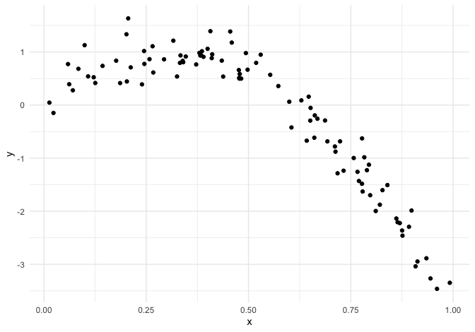
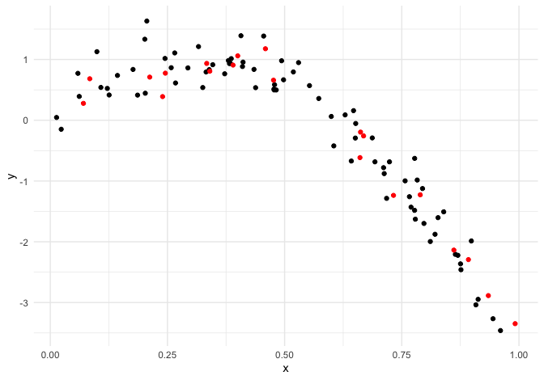
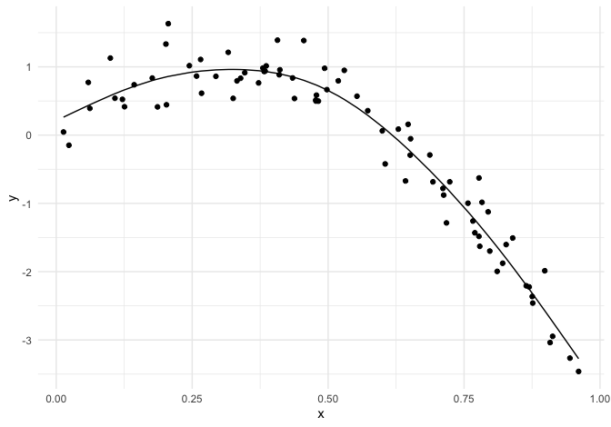
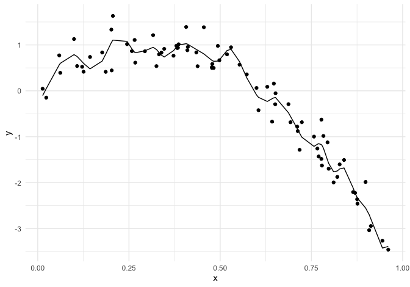
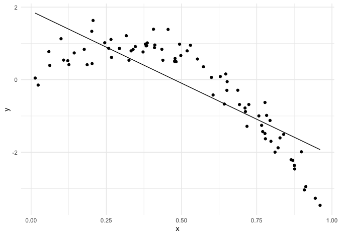
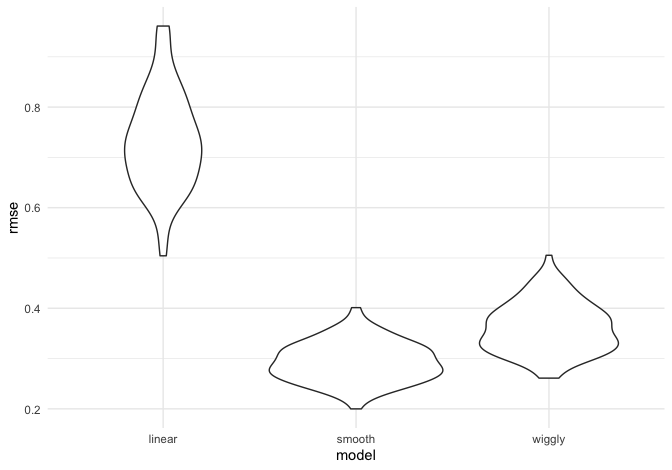
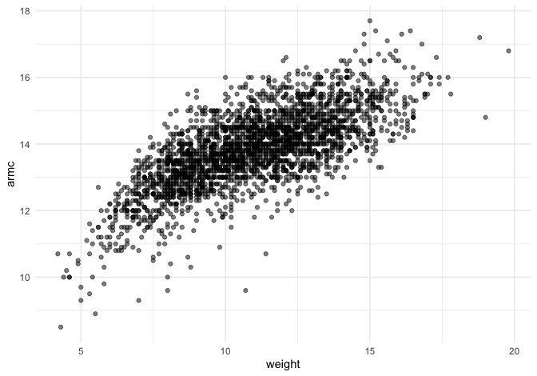
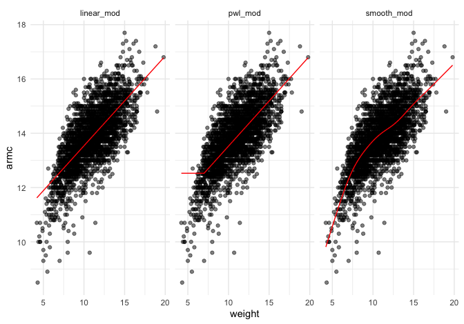
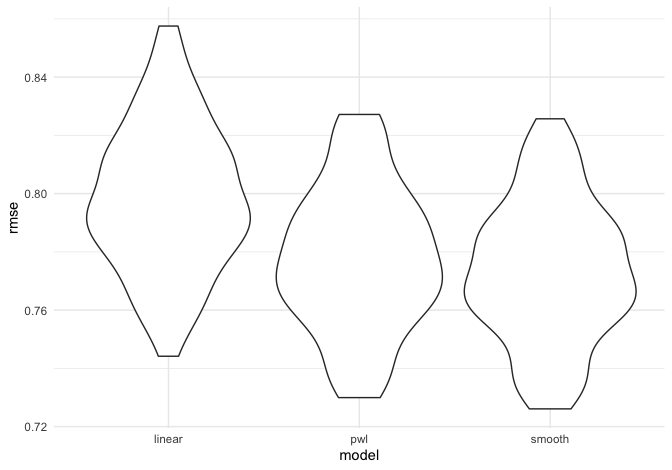

cross\_validation
================
Kaila Boyer
11/18/2021

## Simulate a dataset

``` r
set.seed(1)

nonlin_df = 
  tibble(
    id = 1:100,
    x = runif(100, 0, 1),
    y = 1 - 10 * (x - .3) ^ 2 + rnorm(100, 0, .3)
  )

nonlin_df %>% 
  ggplot(aes(x = x, y = y)) + 
  geom_point()
```



Create splits by hand; plot; fit some models

``` r
train_df<- sample_n(nonlin_df,80)
#look for people in nonlin_df that are not in train_df
test_df <- anti_join(nonlin_df, train_df, by = "id")

ggplot(train_df, aes(x = x, y =y)) + 
  geom_point() + 
  geom_point(data = test_df, color = "red")
```



Fit my models:

``` r
linear_mod <- lm(y ~ x, train_df)
smooth_mod <- mgcv::gam(y ~s(x), data = train_df)

wiggly_mod <- mgcv::gam(y ~ s(x, k = 30), sp = 10e-6, data = train_df)
```

plot the results

``` r
train_df %>% 
  add_predictions(smooth_mod) %>% 
  ggplot(aes( x =x, y = y)) + 
  geom_point() + 
  geom_line(aes(y =pred))
```



``` r
train_df %>% 
  add_predictions(wiggly_mod) %>% 
  ggplot(aes( x =x, y = y)) + 
  geom_point() + 
  geom_line(aes(y =pred))
```



``` r
train_df %>% 
  add_predictions(linear_mod) %>% 
  ggplot(aes( x =x, y = y)) + 
  geom_point() + 
  geom_line(aes(y =pred))
```



quantify the results

``` r
rmse(linear_mod, test_df)
```

    ## [1] 0.7052956

``` r
rmse(smooth_mod, test_df) 
```

    ## [1] 0.2221774

``` r
rmse(wiggly_mod, test_df)
```

    ## [1] 0.289051

## CV iteratively

use ‘modelr::crossv\_mc’

``` r
cv_df <- crossv_mc(nonlin_df, 100)

cv_df %>% pull(train) %>% .[[1]] %>% as_tibble()
```

    ## # A tibble: 79 × 3
    ##       id      x       y
    ##    <int>  <dbl>   <dbl>
    ##  1     1 0.266   1.11  
    ##  2     2 0.372   0.764 
    ##  3     3 0.573   0.358 
    ##  4     4 0.908  -3.04  
    ##  5     6 0.898  -1.99  
    ##  6     7 0.945  -3.27  
    ##  7     8 0.661  -0.615 
    ##  8     9 0.629   0.0878
    ##  9    10 0.0618  0.392 
    ## 10    11 0.206   1.63  
    ## # … with 69 more rows

``` r
cv_df %>% pull(train) %>% .[[100]] %>% as_tibble()
```

    ## # A tibble: 79 × 3
    ##       id      x       y
    ##    <int>  <dbl>   <dbl>
    ##  1     1 0.266   1.11  
    ##  2     2 0.372   0.764 
    ##  3     3 0.573   0.358 
    ##  4     4 0.908  -3.04  
    ##  5     5 0.202   1.33  
    ##  6     6 0.898  -1.99  
    ##  7     7 0.945  -3.27  
    ##  8     8 0.661  -0.615 
    ##  9     9 0.629   0.0878
    ## 10    10 0.0618  0.392 
    ## # … with 69 more rows

``` r
cv_df <- crossv_mc(nonlin_df, 100) %>% 
  mutate(train = map(train, as_tibble), 
         test = map(test, as_tibble))
```

fit candidate models and assess prediction accuracy

``` r
cv_df <- cv_df %>% 
  mutate( 
    linear_mod = map(train, ~lm(y~ x, data = .x)), 
    smooth_mod = map(train, ~mgcv::gam(y ~ s(x), data = .x)), 
    wiggly_mod = map(train, ~gam(y ~ s(x, k = 30), sp = 10e-6, data = .x))) %>% 
  mutate(
    rmse_linear = map2_dbl(linear_mod, test, ~rmse(model = .x, data = .y)), 
    rmse_smooth = map2_dbl(smooth_mod, test, ~rmse(model = .x, data = .y)), 
    rmse_wiggly = map2_dbl(wiggly_mod, test, ~rmse(model = .x, data = .y))
  )

cv_df %>% 
  select(starts_with("rmse")) %>% 
  pivot_longer(
    everything(), 
    names_to = "model", 
    values_to = "rmse", 
    names_prefix = "rmse_"
  ) %>% 
  mutate(model = fct_inorder(model)) %>% 
  ggplot(aes(x = model, y = rmse)) + 
  geom_violin()
```



## Child Growth Example

``` r
child_growth <- read_csv("nepalese_children.csv")
```

    ## Rows: 2705 Columns: 5

    ## ── Column specification ────────────────────────────────────────────────────────
    ## Delimiter: ","
    ## dbl (5): age, sex, weight, height, armc

    ## 
    ## ℹ Use `spec()` to retrieve the full column specification for this data.
    ## ℹ Specify the column types or set `show_col_types = FALSE` to quiet this message.

``` r
child_growth %>% 
  ggplot(aes( x = weight, y = armc)) + 
  geom_point(alpha = 0.5)
```



``` r
child_growth <- child_growth %>% 
  mutate(weight_cp = (weight > 7) * (weight - 7))
```

The piecewise linear model is nested in the linear model and could be
assessed using statistical significance, but the smooth model is not
nested in anything else.

``` r
linear_mod <- lm(armc ~ weight, data = child_growth)
pwl_mod <- lm(armc ~ weight_cp, data = child_growth)
smooth_mod <- gam(armc ~ s(weight), data = child_growth)

child_growth %>% 
  gather_predictions(linear_mod, pwl_mod, smooth_mod) %>% 
  mutate(model = fct_inorder(model)) %>% 
  ggplot(aes(x = weight, y = armc)) + 
  geom_point(alpha = 0.5) + 
  geom_line(aes(y = pred), color = "red") + 
  facet_grid(~model)
```



``` r
cv_df <- 
  crossv_mc(child_growth, 100) %>% 
  mutate(
    train = map(train, as_tibble), 
    test = map(test, as_tibble)
  )

cv_df <- cv_df %>% 
  mutate(linear_mod = map(train, ~lm(armc ~ weight, data = .x)), 
         pwl_mod = map(train, ~lm(armc ~ weight + weight_cp, data = .x)), 
         smooth_mod = map(train, ~gam(armc ~ s(weight), data = as_tibble(.x)))) %>% 
  mutate(
    rmse_linear = map2_dbl(linear_mod, test, ~rmse(model = .x, data = .y)), 
    rmse_pwl = map2_dbl(pwl_mod, test, ~rmse(model = .x, data = .y)), 
    rmse_smooth = map2_dbl(smooth_mod, test, ~rmse(model = .x, data = .y))
  )
```

plot of prediction error distribution for each candidate model

``` r
cv_df %>% 
  select(starts_with("rmse")) %>% 
  pivot_longer(
    everything(), 
    names_to = "model", 
    values_to = "rmse", 
    names_prefix = "rmse_"
  ) %>% 
  mutate(model = fct_inorder(model)) %>% 
  ggplot(aes(x = model, y = rmse)) + 
  geom_violin()
```


